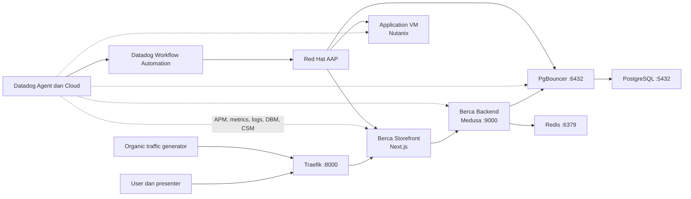
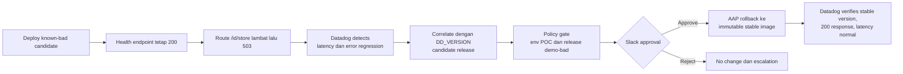
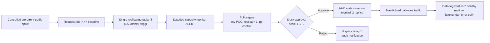
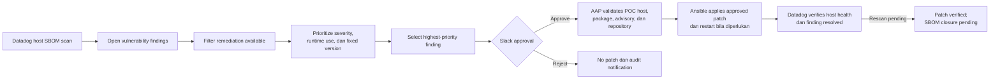
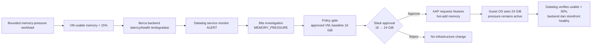
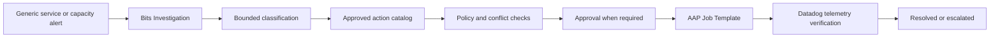

# AI-Driven Autonomous Remediation with Datadog and Red Hat Ansible

> Ringkasan final untuk penyusunan slide deck dan live sales demo. Seluruh enam
> skenario diasumsikan telah berhasil divalidasi end-to-end menggunakan Datadog
> dan Red Hat Ansible Automation Platform pada lingkungan Lab.

## Executive summary

Berca Store adalah aplikasi e-commerce berbasis Medusa yang berjalan pada VM
aplikasi di Nutanix dan digunakan sebagai lingkungan demo terkontrol. POC ini
menunjukkan bagaimana Datadog dan Red Hat Ansible berkolaborasi untuk menangani
reliability, capacity, deployment, infrastructure, dan security operations.

Datadog bertanggung jawab untuk mengamati kondisi, mendeteksi dampak, membantu
investigasi, menerapkan policy gate, meminta persetujuan bila diperlukan, dan
memverifikasi hasil melalui telemetry. Red Hat Ansible Automation Platform
(AAP) menjalankan tindakan yang sudah disetujui melalui inventory, credential,
dan Job Template yang terkontrol.

```text
Datadog determines what happened, what is affected, and whether action is safe.
Ansible determines how the approved change is executed consistently.
Datadog verifies whether the business service actually recovered.
```

Nilai utama untuk customer:

- memperpendek waktu dari deteksi hingga recovery;
- mengurangi pekerjaan manual untuk incident yang berulang;
- menghubungkan AIOps, infrastructure automation, dan security remediation;
- mempertahankan human approval untuk perubahan berisiko;
- membatasi AI pada diagnosis dan pemilihan tindakan yang sudah disetujui;
- memberikan audit trail dari alert, approval, job automation, dan telemetry.

## Portfolio enam skenario

| No. | Domain | Skenario | Target | Tindakan Ansible |
|---:|---|---|---|---|
| 1 | Reliability | Database connection pool full | PgBouncer | Menghentikan synthetic pool pressure dan memulihkan antrean |
| 2 | Reliability | Synthetic disk log full | Volume log POC | Menghentikan log growth dan membersihkan file yang diizinkan |
| 3 | Deployment | Application deployment regression | Berca Storefront | Rollback ke immutable stable release |
| 4 | Capacity | Horizontal scaling | Container storefront | Scale-out dari satu menjadi dua replica |
| 5 | Security | Vulnerable package pada RHEL | VM RHEL di Nutanix | Patch package/advisory yang disetujui |
| 6 | Infrastructure | VM memory pressure | VM aplikasi Berca | Hot-add RAM dari 16 GiB menjadi 24 GiB |

Enam skenario ini membentuk satu portfolio, tetapi dijalankan secara terpisah
agar root cause, tindakan, dan hasil setiap demo mudah dipahami.

## Pesan utama demo

```text
Detect
→ Investigate and prioritize
→ Apply policy guardrails
→ Request approval when required
→ Execute approved Ansible automation
→ Verify with Datadog telemetry
→ Resolve or escalate safely
```

POC tidak menganggap job AAP berstatus `successful` sebagai bukti recovery.
Datadog tetap menjadi sumber verifikasi akhir untuk service health, latency,
error, capacity, host state, dan security finding.

## Arsitektur lingkungan demo



Komponen penting:

| Komponen | Fungsi |
|---|---|
| `berca-storefront` | Next.js production storefront dan target scale/rollback |
| `berca-backend` | Medusa hero service dan sumber business-service telemetry |
| `pgbouncer` | Connection pool baseline `5/5` |
| `postgres` | Database commerce dan DBM telemetry |
| `traffic-generator` | Organic storefront journey dan guest checkout nyata |
| `traefik` | Reverse proxy dan load balancing antar-replica storefront |
| `pool-hog` | Synthetic connection pressure yang deterministic |
| `log-generator` | Synthetic log growth pada isolated loopback filesystem |
| `memory-pressure` | Bounded memory holder pada VM aplikasi |
| Datadog | Detection, investigation, policy, approval, dan verification |
| Red Hat AAP | Controlled execution melalui Job Template dan inventory |
| Nutanix | Platform VM untuk skenario RHEL security dan memory hot-add |

Tag utama:

```text
env:poc
service:berca-backend
service:berca-storefront
service:berca-traffic-generator
resource_id:pgbouncer-demo
resource_id:synthetic-log-volume
platform:nutanix
```

## Workload yang realistis

Guest purchase flow dapat diperlihatkan langsung kepada customer:

```text
Homepage → katalog → detail produk → cart → checkout → order confirmation
```

Traffic generator menjalankan browsing, cart abandonment, checkout
abandonment, expected user error, dan guest checkout yang benar-benar
menghasilkan order. Storefront dan backend tetap menerima traffic selama fault
dan remediation sehingga recovery tidak hanya diuji saat environment idle.

Storefront berjalan sebagai Next.js production server, backend Medusa memakai
prebuilt Admin UI, dan health endpoint dibuat ringan agar development
compilation tidak mengganggu cerita observability.

---

## Skenario 1 — Database connection pool full

### Cerita customer

Lonjakan penggunaan menyebabkan seluruh server connection PgBouncer aktif.
Request backend mulai mengantre dan user mengalami latency atau timeout.
Datadog menghubungkan service impact dengan telemetry PgBouncer, lalu Ansible
menjalankan recovery yang sudah disetujui tanpa mengubah baseline pool.

```mermaid
flowchart LR
  A["Organic traffic aktif"] --> B["Synthetic pool pressure<br/>25 clients"]
  B --> C["PgBouncer penuh<br/>sv_active = 5"]
  C --> D["Client menunggu<br/>cl_waiting > 0"]
  D --> E["Backend latency dan error naik"]
  E --> F["Datadog monitor ALERT"]
  F --> G["Bits investigation<br/>classification: POOL"]
  G --> H["Policy memilih approved response"]
  H --> I["AAP menjalankan<br/>pool remediation"]
  I --> J["Synthetic pressure berhenti"]
  J --> K["Datadog verifies<br/>cl_waiting = 0 dan health OK"]
```



Fault evidence:

```text
sv_active = 5
cl_waiting > 0
backend latency/error meningkat
```

Ansible action:

- menghentikan hanya dedicated pool-pressure workload;
- mempertahankan PgBouncer pada baseline `5/5`;
- memastikan tidak ada waiting client yang tersisa.

Recovery evidence:

```text
cl_waiting = 0
PgBouncer tetap 5/5
backend latency kembali normal
backend health OK
```

Business message: automation menghilangkan connection pressure secara aman
tanpa memperbesar database pool secara permanen atau menyentuh database lain.

---

## Skenario 2 — Synthetic disk log full

### Cerita customer

Pertumbuhan log yang tidak terkendali menghabiskan filesystem aplikasi dan
menimbulkan service degradation. Datadog menghubungkan disk usage, log growth,
time-to-full, dan health signal. Ansible membersihkan hanya synthetic volume
yang sudah di-whitelist.

```mermaid
flowchart LR
  A["Synthetic log generator aktif"] --> B["Loopback ext4 POC terisi"]
  B --> C["Disk usage mencapai 80–85%"]
  C --> D["Backend health dan latency terdegradasi"]
  D --> E["Datadog monitor ALERT"]
  E --> F["Bits investigation<br/>classification: DISK"]
  F --> G["Policy memvalidasi target volume POC"]
  G --> H["AAP menjalankan<br/>disk remediation"]
  H --> I["Stop generator dan truncate<br/>synthetic log yang diizinkan"]
  I --> J["Datadog verifies<br/>disk < 20% dan growth = 0"]
```



Fault evidence:

```text
isolated disk usage sekitar 85%
synthetic log growth > 0
time-to-full menurun
backend health terdegradasi
```

Ansible action:

- memvalidasi target sebagai loopback ext4 milik POC;
- menghentikan synthetic log generator;
- menghapus trigger dan impact marker;
- truncate hanya file synthetic yang diizinkan dan menjalankan `sync`.

Recovery evidence:

```text
disk usage < 20%
synthetic log growth = 0
backend health OK
```

Business message: remediation memiliki blast radius yang jelas dan tidak
menghapus log aplikasi atau filesystem di luar target POC.

---

## Skenario 3 — Application deployment rollback

### Cerita customer

Release kandidat storefront berhasil start dan health check tetap hijau, tetapi
route katalog menjadi lambat lalu mengembalikan error. Datadog mendeteksi
regression dari telemetry pengguna, mengorelasikannya dengan release version,
dan meminta approval sebelum Ansible melakukan rollback.



Fault evidence:

```text
/api/healthz = 200
/id/store = delayed 503
DD_VERSION = demo-bad release
storefront latency/error meningkat
```

Ansible action:

- rollback hanya service storefront;
- menggunakan immutable stable image/digest yang sudah disetujui;
- tidak melakukan build saat demo;
- tidak menyentuh cart, order, backend, atau database.

Recovery evidence:

```text
DD_VERSION kembali ke stable
/api/healthz = 200
/id/store = 200
p95 dan error rate kembali aman
```

Business message: green health check tidak selalu berarti customer experience
sehat; Datadog menemukan impact dan Ansible mengembalikan release secara
konsisten.

---

## Skenario 4 — Horizontal scaling storefront

### Cerita customer

Traffic storefront meningkat dan satu replica tidak lagi cukup menjaga target
latency. Datadog mendeteksi capacity pressure, memastikan tidak ada incident
lain yang aktif, meminta approval, lalu Ansible menambah replica di belakang
Traefik.



Trigger evidence:

```text
request rate >= 4 × baseline
p95 > max(2 × baseline p95, 1.5 detik)
storefront replicas = 1
```

Ansible action:

- scale hanya `berca-storefront` dari satu menjadi dua replica;
- tidak menerima replica count, service name, host, atau Compose path bebas;
- memastikan Traefik dan kedua replica sehat.

Recovery evidence:

```text
storefront replicas = 2
kedua replica healthy
p95 kembali di bawah threshold
error rate kembali aman
/api/healthz tetap OK
```

Scale-in dilakukan secara terkontrol setelah traffic spike dihentikan. Business
message: observability menentukan kapan capacity dibutuhkan, approval menjaga
governance, dan Ansible mengeksekusi perubahan secara repeatable.

---

## Skenario 5 — Vulnerable package remediation pada RHEL

### Cerita customer

Datadog Cloud Security menemukan package vulnerable pada VM RHEL di Nutanix,
menampilkan CVE, severity, affected package, dan remediation availability.
Workflow memprioritaskan finding yang dapat diremediasi dan meminta approval
sebelum AAP menerapkan patch.

Workflow vulnerability dipisahkan dari workflow operational incident agar
security approval, evidence, dan verification mempunyai audit trail sendiri.



Finding evidence:

```text
status = open
remediation available = true
CVE dan package teridentifikasi
fixed version tersedia
target = approved RHEL POC VM
```

Ansible action:

- membatasi target ke inventory VM RHEL POC;
- memvalidasi package terpasang dan patch tersedia dari repository resmi;
- menerapkan hanya remediation yang telah disetujui;
- me-restart service atau VM hanya bila patch benar-benar memerlukannya;
- menghasilkan before/after package evidence.

Recovery evidence:

```text
AAP patch job successful
RHEL host dan Datadog Agent healthy
package version berubah ke fixed version
finding resolved setelah SBOM refresh
```

Business message: Datadog menentukan apa yang vulnerable dan dampaknya;
Ansible menentukan bagaimana patch dilakukan dengan aman dan konsisten.

---

## Skenario 6 — VM memory pressure dan hot-add RAM

### Cerita customer

VM aplikasi mengalami memory pressure ketika workload tetap aktif. Usable
memory turun dan backend mulai terdegradasi. Datadog mengorelasikan host memory
dengan service impact, meminta approval, kemudian AAP menggunakan automation
Nutanix untuk hot-add RAM tanpa menghentikan synthetic pressure.



Fault evidence:

```text
system.mem.pct_usable < 15%
backend p95 melewati threshold
memory-pressure tetap aktif
tidak ada dominant pool, disk, deployment, atau horizontal-capacity issue
```

Ansible action:

- menargetkan fixed Nutanix application VM;
- hot-add RAM dari approved profile 16 GiB ke 24 GiB;
- menunggu guest OS dan Datadog Agent melihat kapasitas baru;
- mencegah repeated alert menaikkan RAM di atas 24 GiB.

Recovery evidence:

```text
system.mem.total >= 24 GiB
system.mem.pct_usable > 30%
memory-pressure masih aktif
backend monitor kembali OK
storefront /id/store = 200
```

Reset menghentikan memory pressure lalu Ansible mengembalikan VM ke baseline
16 GiB. Business message: customer dapat melihat vertical elasticity pada VM
existing tanpa memindahkan aplikasi ke platform baru.

---

## Model automation dan governance

### Operational remediation workflow

Digunakan untuk pool, disk, rollback, horizontal scaling, dan memory hot-add:



Allowed operational classifications:

```text
POOL
DISK
AUTOSCALE
ROLLBACK
MEMORY_PRESSURE
UNKNOWN
```

`UNKNOWN` tidak menjalankan perubahan apa pun.

### Security remediation workflow

Vulnerability menggunakan workflow terpisah:

```text
Query findings → Prioritize → Select one → Approval → AAP patch
→ Poll AAP → Validate host → Validate finding → Resolved or rescan pending
```

Satu workflow run memproses satu finding prioritas tertinggi. Ini membuat satu
approval berkorespondensi dengan satu perubahan dan satu audit trail.

### Guardrails

- AI tidak menghasilkan command, shell argument, host, path, SQL, image, atau
  playbook.
- Workflow hanya memilih action dari katalog yang sudah disetujui.
- AAP Inventory menetapkan host dan credential target.
- Job Template menetapkan playbook, role, dan execution environment.
- Approval digunakan untuk scale, rollback, patch, dan VM hot-add.
- Skenario tidak dijalankan bersamaan.
- Setiap action idempotent dan bounded pada environment `poc`.
- Semua secret berada di Datadog Connection atau AAP Credential, bukan Git.
- Demo Control API dan `demo-control.sh` hanya menjadi development/emergency
  fallback, bukan execution path utama.

## Peran Datadog, Ansible, dan Nutanix

| Platform | Tanggung jawab |
|---|---|
| Datadog Observability | APM, infrastructure metrics, logs, DBM, PgBouncer, deployment, health, dan capacity evidence |
| Datadog Bits Investigation | Membantu diagnosis operational degradation dari telemetry yang tersedia |
| Datadog Cloud Security | Menemukan, memprioritaskan, dan melacak vulnerability findings |
| Datadog Workflow Automation | Trigger, policy, approval, AAP dispatch, polling, verification, dan escalation |
| Red Hat AAP | Menjalankan approved automation melalui inventory, credential, RBAC, dan Job Template |
| Ansible Playbooks | Fault injection, remediation, rollback, scale, patch, reset, dan evidence collection |
| Nutanix | Menyediakan VM lifecycle dan memory hot-add untuk application infrastructure |

## Telemetry-based success criteria

| Skenario | Datadog harus membuktikan |
|---|---|
| Pool | Queue nol, pool tetap `5/5`, latency/error normal, health OK |
| Disk | Disk aman, growth nol, backend kembali sehat |
| Rollback | Stable version aktif, route katalog 200, latency/error normal |
| Horizontal scaling | Dua replica sehat dan service-level performance pulih |
| Vulnerability | Host sehat, package patched, finding resolved atau rescan pending teridentifikasi |
| Memory hot-add | RAM 24 GiB terlihat, usable memory pulih, service sehat saat pressure masih aktif |

Status AAP `successful` adalah execution evidence. Hanya Datadog telemetry yang
menentukan hasil akhir demo.

## Run of show untuk live demo

### Pembukaan

1. Tunjukkan Berca Storefront, checkout nyata, Medusa Admin, dan organic traffic.
2. Tunjukkan Datadog dashboard dalam kondisi baseline sehat.
3. Jelaskan pembagian tugas Datadog, AAP/Ansible, dan Nutanix.

### Demonstrasi satu use case

1. Presenter menjalankan fixed fault/change scenario melalui Workflow Automation.
2. Datadog menunjukkan perubahan telemetry dan service impact.
3. Bits atau security finding menjelaskan probable cause dan affected resource.
4. Workflow menunjukkan policy/approval gate.
5. AAP menjalankan Job Template yang sudah disetujui.
6. Datadog memverifikasi recovery dari telemetry.
7. Presenter menunjukkan audit evidence dan reset ke baseline.

### Rekomendasi sequencing

Untuk sesi singkat, demonstrasikan tiga cerita yang paling berbeda:

```text
Pool remediation → Storefront scaling → Vulnerability patch
```

Untuk sesi penuh, gunakan urutan:

```text
Pool → Disk → Rollback → Horizontal scaling → Vulnerability → Memory hot-add
```

## Business value per domain

| Domain | Customer value |
|---|---|
| Incident operations | Diagnosis dan recovery berulang menjadi lebih cepat dan konsisten |
| Deployment operations | Regression dapat dikorelasikan dan di-rollback dengan approval |
| Capacity operations | Horizontal dan vertical capacity dapat ditambah berdasarkan service impact |
| Security operations | Finding dengan remediation dapat diterjemahkan menjadi patch terkontrol |
| Governance | Semua perubahan melewati policy, RBAC, approval, dan audit trail |
| Verification | Recovery dinilai dari customer/service telemetry, bukan sekadar status automation |

## Rekomendasi struktur slide deck

| Slide | Judul | Pesan utama |
|---:|---|---|
| 1 | AI-Driven Autonomous Remediation | Datadog + Red Hat Ansible + Nutanix |
| 2 | The operational challenge | Reliability, deployment, capacity, dan security masih ditangani terpisah |
| 3 | Joint solution principle | Detect → Decide → Approve → Automate → Verify |
| 4 | Berca demo environment | Aplikasi nyata, traffic nyata, fault terkontrol |
| 5 | End-to-end architecture | Datadog mengarahkan keputusan; Ansible mengeksekusi |
| 6 | Six-scenario portfolio | Satu operating model untuk enam masalah berbeda |
| 7 | Scenario 1: Pool full | Closed-loop database connection recovery |
| 8 | Scenario 2: Disk full | Safe cleanup dengan target terisolasi |
| 9 | Scenario 3: Rollback | Telemetry-driven deployment recovery |
| 10 | Scenario 4: Horizontal scaling | Approval-gated scale-out di belakang Traefik |
| 11 | Scenario 5: Vulnerability patch | Datadog CSM → approval → AAP patch |
| 12 | Scenario 6: Memory hot-add | Nutanix VM vertical scaling berdasarkan service impact |
| 13 | AI with boundaries | Classification dari approved catalog, bukan arbitrary command |
| 14 | Governance and approval | Policy, RBAC, Slack approval, dan safe rejection |
| 15 | Telemetry-based verification | Automation success bukan recovery success |
| 16 | Live demo walkthrough | Baseline → impact → action → recovery → reset |
| 17 | Customer outcomes | Faster recovery, safer change, repeatable operations |
| 18 | Adoption roadmap | Mulai dari repetitive POC actions lalu perluas secara bertahap |

## Suggested proof points untuk slide

- `sv_active`, `cl_waiting`, dan PgBouncer baseline sebelum/sesudah.
- Disk usage, log growth, dan backend health sebelum/sesudah.
- `DD_VERSION`, catalog error, serta stable version setelah rollback.
- Storefront replica count dan p95 latency sebelum/sesudah scale-out.
- CVE/package/fixed version, Slack approval, AAP job, dan finding status.
- `system.mem.total` serta `system.mem.pct_usable` sebelum/sesudah hot-add.
- Screenshot AAP Job Template output untuk setiap remediation.
- Datadog Workflow run history sebagai end-to-end audit trail.

## Scope statement

POC ini adalah live sales demo yang stabil, repeatable, dan mudah dipahami.
Tujuannya membuktikan pola kolaborasi produk, bukan menggantikan seluruh desain
production operations.

Sengaja tidak dibangun:

- arbitrary AI-generated commands atau playbooks;
- combined/random fault;
- perubahan lintas-environment tanpa inventory boundary;
- unbounded autoscaling atau repeated memory hot-add;
- automatic production patch tanpa approval;
- complex retry ladder, high availability, dan production credential design;
- final enterprise operating model untuk change management.

## Dokumen sumber

- [`load-test/UNIFIED-POC.md`](load-test/UNIFIED-POC.md) — technical POC runbook.
- [`load-test/scenario-controller.json`](load-test/scenario-controller.json) — scenario activation workflow.
- [`load-test/remediation-apps.json`](load-test/remediation-apps.json) — operational remediation workflow.
- [`load-test/soar.json`](load-test/soar.json) — vulnerability remediation workflow.
- [`ansible/README.md`](ansible/README.md) — AAP and Ansible integration contract.
- [`ansible/cve_playbooks/`](ansible/cve_playbooks/) — RHEL vulnerability remediation implementation.
- [`load-test/AUTOSCALE-POC.md`](load-test/AUTOSCALE-POC.md) — storefront scaling runbook.
