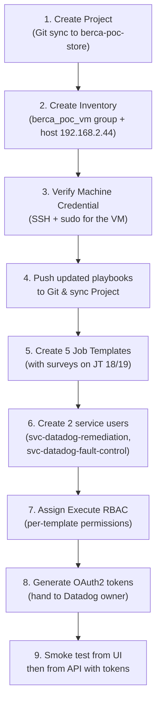

# AAP Controller Setup — Step-by-Step Walkthrough

> [!NOTE]
> This guide uses your environment details:
> - **AAP Controller**: `https://192.168.2.66`
> - **Managed VM**: `192.168.2.44`
> - **SSH Credential**: already configured in AAP
> - **Playbook repo**: `berca-poc-store` under `ansible/`

---

## Step 1 — Create the Project

The Project links AAP to your Git repository so it can find the playbooks.

### 1.1 Navigate

1. Open `https://192.168.2.66` in your browser and log in
2. In the left sidebar, go to **Resources** → **Projects**
3. Click the **Create project** button (top right)

### 1.2 Fill in the form

| Field | Value |
|---|---|
| **Name** | `Berca POC Playbooks` |
| **Organization** | *(select your organization)* |
| **Source Control Type** | `Git` |
| **Source Control URL** | The Git URL of `berca-poc-store` (e.g., `https://github.com/avecenabasuni/berca-poc-store.git` or your internal Git URL) |
| **Source Control Branch/Tag/Commit** | `main` *(or whichever branch you use)* |
| **Source Control Credential** | *(select if your repo is private, otherwise leave empty)* |

### 1.3 About "Sync on Launch"

> [!IMPORTANT]
> There is no option literally called "Sync on launch." The correct option is called **"Update revision on launch"** (sometimes labeled **"Update on launch"**). It is a checkbox in the **Options** section at the bottom of the Project creation form.

- Scroll down to the **Options** section
- Check ✅ **Update revision on launch** — this makes AAP pull the latest playbook code from Git every time a Job Template runs
- Click **Save**

### 1.4 Verify

After saving, AAP will automatically trigger a first sync. On the Projects list page:
- Wait for the **Status** column to show a green ✅ **Successful**
- If it fails, click on the project name and check the **Output** tab for sync errors (usually a wrong URL or missing credential)

---

## Step 2 — Create the Inventory & Set Variables

### 2.1 Create the Inventory

1. Left sidebar → **Resources** → **Inventories**
2. Click **Create inventory** → select **Create inventory** (not Smart Inventory)
3. Fill in:

| Field | Value |
|---|---|
| **Name** | `Berca POC VM` |
| **Organization** | *(same org as your Project)* |

4. Click **Save**

### 2.2 Create the Host Group

1. After saving, you'll see the inventory detail page
2. Click the **Groups** tab
3. Click **Create group**
4. Fill in:

| Field | Value |
|---|---|
| **Name** | `berca_poc_vm` |

5. **This is where you set your variables.** Find the **Variables** text editor on the form. It accepts YAML. Paste the following:

```yaml
---
poc_project_path: /home/ave/berca-poc-store
poc_state_dir: "{{ poc_project_path }}/docker/demo-state"
poc_log_dir: "{{ poc_project_path }}/docker/log-saturation/data"
poc_disk_image: /tmp/poc-log-disk.img
poc_disk_trigger: "{{ poc_log_dir }}/.trigger_saturation"
poc_disk_log: "{{ poc_log_dir }}/app-saturation.log"
poc_impact_marker: "{{ poc_state_dir }}/disk-degraded"
poc_pgbouncer_target_db: medusa-store
poc_pgbouncer_target_user: postgres
poc_baseline_pool_size: 5
poc_baseline_max_connections: 5
poc_safe_disk_usage_pct: 20
poc_pool_hog_container: berca_poc_pool_hog
poc_lock_dir: /run/lock/berca-poc-demo
```

> [!NOTE]
> `poc_project_path` points to where the Docker Compose stack is already deployed on the VM — Ansible uses this path to run `docker compose` commands and locate fault/recovery targets. The repo is NOT cloned for Ansible; it's the existing application deployment.

6. Click **Save**

### 2.3 Add the Host to the Group

1. Click into the `berca_poc_vm` group you just created
2. Click the **Hosts** tab
3. Click **Create host**
4. Fill in:

| Field | Value |
|---|---|
| **Name** | `192.168.2.44` |

5. In the **Variables** editor for this host, add:

```yaml
---
ansible_host: 192.168.2.44
```

6. Click **Save**

### Where variables live — summary

```text
Inventory: Berca POC VM
  └── Group: berca_poc_vm
  │     └── Variables: all poc_* variables (YAML editor on the group form)
  └── Host: 192.168.2.44
        └── Variables: ansible_host: 192.168.2.44
```

Variables set on the **Group** apply to all hosts in that group. You can view/edit them anytime by going to **Inventories** → clicking the inventory → **Groups** tab → clicking the group → editing the **Variables** field.

---

## Step 3 — Machine Credential

Since you already have the SSH credential configured in AAP, you just need to know its name so you can assign it to Job Templates later.

### 3.1 Verify your existing credential

1. Left sidebar → **Resources** → **Credentials**
2. Find your existing Machine credential in the list (the one with SSH user `ave`)
3. Click on it to verify:
   - **Credential Type** = `Machine`
   - **Username** = `ave`
   - Privilege Escalation Method = `sudo` (if your playbooks need `become: true`)
4. **Take note of the credential name** — you'll use it in every Job Template

> [!TIP]
> If `become: true` is needed (and the spec requires it), make sure the **Privilege Escalation** section has:
> - **Privilege Escalation Method**: `sudo`
> - **Privilege Escalation Username**: `root` (or blank, which defaults to root)
> - **Privilege Escalation Password**: *(filled in if the user requires a sudo password)*

---

## Step 4 — Create Two Service Account Users & OAuth2 Tokens

You need two scoped service accounts so Datadog uses separate tokens for fault injection vs. remediation.

### 4.1 Create the Remediation Service Account

1. Left sidebar → **Access** → **Users**  
   *(In some AAP versions: **Access Management** → **Users**)*
2. Click **Create user**
3. Fill in:

| Field | Value |
|---|---|
| **Username** | `svc-datadog-remediation` |
| **Email** | `svc-datadog-remediation@internal` *(AAP requires this field, but it has no functional purpose for service accounts — just fill in any valid-looking email)* |
| **Password** | *(set a strong password; it won't be used directly — the OAuth2 token will be used instead)* |
| **User Type** | `Normal User` |

4. Click **Save**

### 4.2 Create the Fault Control Service Account

1. Repeat the same steps with:

| Field | Value |
|---|---|
| **Username** | `svc-datadog-fault-control` |
| **Email** | `svc-datadog-fault-control@internal` |
| **Password** | *(strong password)* |
| **User Type** | `Normal User` |

2. Click **Save**

### 4.3 Generate OAuth2 Tokens

You will generate tokens **after** creating the Job Templates (Step 5), because you need to assign permissions to specific templates first. The token generation steps are in **Step 6**.

---

## Step 5 — Create the Job Templates

You need 5 Job Templates total. Create them one by one.

> [!IMPORTANT]
> The playbook paths below are relative to the project root. Since your Project points to `berca-poc-store`, the thin playbooks are directly under `ansible/` (e.g., `ansible/recover-pool.yml`). The reusable role is at `ansible/roles/berca_poc_demo/` — Ansible resolves it automatically because the `roles/` directory is adjacent to the playbooks.
>
> You need to **push the new playbooks to Git first** and sync the Project before the playbooks appear in the dropdown.

### 5.1 Job Template 18 — Pool Remediation

1. Left sidebar → **Resources** → **Templates**
2. Click **Create template** → **Create job template**
3. Fill in:

| Field | Value |
|---|---|
| **Name** | `Pool Remediation` |
| **Job Type** | `Run` |
| **Inventory** | `Ansible Datadog Collab POC VMs` |
| **Project** | `Ansible Datadog Playbooks` |
| **Playbook** | `ansible/recover-pool.yml` *(select from dropdown)* |
| **Credential** | `Datadog Credential` |
| **Forks** | `1` |
| **Job Timeout** | `300` (seconds) |

4. Scroll to the **Options** section. Make sure these are set:
   - ✅ **Privilege Escalation** (this enables `become: true`)
   - ❌ **Enable Concurrent Jobs** — leave this **unchecked** (disables simultaneous runs)
   - ❌ **Prompt on Launch** for Inventory — leave **unchecked**
   - ❌ **Prompt on Launch** for Credentials — leave **unchecked**
   - ❌ **Prompt on Launch** for Extra Variables — leave **unchecked**

5. Click **Save**

#### Add Survey Fields to JT 18

After saving, you'll see the template detail page:

1. Click the **Survey** tab
2. Click **Create survey question** and add the following 3 questions, one at a time:

**Question 1:**

| Field | Value |
|---|---|
| **Question** | `Datadog Monitor ID` |
| **Description** | `The Datadog monitor that triggered this remediation` |
| **Answer variable name** | `monitor_id` |
| **Answer type** | `Text` |
| **Minimum length** | `1` |
| **Maximum length** | `255` |
| **Required** | ✅ Yes |

Click **Save** → then **Create survey question** again.

**Question 2:**

| Field | Value |
|---|---|
| **Question** | `Bits Investigation ID` |
| **Description** | `The Bits investigation ID from Datadog` |
| **Answer variable name** | `investigation_id` |
| **Answer type** | `Text` |
| **Minimum length** | `1` |
| **Maximum length** | `255` |
| **Required** | ✅ Yes |

Click **Save** → then **Create survey question** again.

**Question 3:**

| Field | Value |
|---|---|
| **Question** | `Datadog Workflow Instance ID` |
| **Description** | `The workflow run instance ID from Datadog` |
| **Answer variable name** | `workflow_instance_id` |
| **Answer type** | `Text` |
| **Minimum length** | `1` |
| **Maximum length** | `255` |
| **Required** | ✅ Yes |

Click **Save**.

3. Make sure the **Survey** toggle at the top of the Survey tab is **enabled** (turned on).

### 5.2 Job Template 19 — Disk Remediation

Repeat the same process as JT 18, with these differences:

| Field | Value |
|---|---|
| **Name** | `Disk Remediation` |
| **Playbook** | `ansible/recover-disk.yml` |

- Same Inventory, Credential, timeout, and options as JT 18
- **Same 3 survey questions** (identical `monitor_id`, `investigation_id`, `workflow_instance_id`)

### 5.3 Job Template 20 — Full Reset

| Field | Value |
|---|---|
| **Name** | `Full Reset` |
| **Playbook** | `ansible/reset.yml` |

- Same Inventory and Credential
- **No survey needed** — this template is triggered manually or by Workflow 1 reset
- Timeout: `300`
- Concurrent jobs: disabled

### 5.4 Pool Fault (Job Template 21)

| Field | Value |
|---|---|
| **Name** | `Pool Fault` |
| **Playbook** | `ansible/fault-pool.yml` |

- Same Inventory and Credential
- **No survey needed**
- Timeout: `300`
- Concurrent jobs: disabled

### 5.5 Disk Fault (Job Template 22)

| Field | Value |
|---|---|
| **Name** | `Disk Fault` |
| **Playbook** | `ansible/fault-disk.yml` |

- Same Inventory and Credential
- **No survey needed**
- Timeout: `300`
- Concurrent jobs: disabled

### 5.6 Record your Job Template IDs

After creating all templates, go to **Resources** → **Templates** and note each template's numeric **ID** (visible in the URL when you click on a template, e.g., `https://192.168.2.66/#/templates/job_template/13/details`):

| Template Name | ID | Share with |
|---|---|---|
| Pool Remediation | `18` | Datadog Workflow 2 owner |
| Disk Remediation | `19` | Datadog Workflow 2 owner |
| Full Reset | `20` | Datadog Workflow 1 owner |
| Pool Fault | `21` | Datadog Workflow 1 owner |
| Disk Fault | `22` | Datadog Workflow 1 owner |

---

## Step 6 — Assign RBAC Permissions & Generate Tokens

### 6.1 Give `svc-datadog-remediation` Execute access to JT 18 and JT 19 only

1. Go to **Resources** → **Templates**
2. Click on **Pool Remediation** (JT 18)
3. Click the **User Access** tab (or **Access** tab, depending on AAP version)
4. Click **Add roles** (or the **+** button)
5. In the dialog:
   - Search for user: `svc-datadog-remediation`
   - Select that user
   - Click **Next**
   - Check the **Execute** role only
   - Click **Save**

6. Repeat for **Disk Remediation** (JT 19) — same user, same Execute role

> [!CAUTION]
> Do **NOT** add `svc-datadog-remediation` to any other template, project, inventory, or credential. This user should only be able to launch JT 18 and JT 19.

### 6.2 Give `svc-datadog-fault-control` Execute access to fault + reset templates

Repeat the same steps, but:
- User: `svc-datadog-fault-control`
- Templates: **Pool Fault** (JT 21), **Disk Fault** (JT 22), and **Full Reset** (JT 20)
- Role: **Execute** only

### 6.3 Generate OAuth2 Personal Access Tokens

For each service account, generate a token:

**Option A — Via the AAP UI (if your version supports it):**

1. Log out of your admin account
2. Log in as `svc-datadog-remediation`
3. Click your username in the top-right corner → **User Profile** or **Tokens**
4. Click **Create token**
5. Set **Scope** to `Write` (needed to launch jobs)
6. Click **Save**
7. **Copy the token immediately** — it will not be shown again
8. Repeat for `svc-datadog-fault-control`

**Option B — Via the API (more reliable):**

Run this from any machine that can reach the AAP controller:

```bash
# Token for svc-datadog-remediation
curl -k -X POST https://192.168.2.66/api/controller/v2/users/<REMEDIATION_USER_ID>/personal_tokens/ \
  -H "Content-Type: application/json" \
  -u "admin:<ADMIN_PASSWORD>" \
  -d '{"scope": "write"}'
```

```bash
# Token for svc-datadog-fault-control
curl -k -X POST https://192.168.2.66/api/controller/v2/users/<FAULT_USER_ID>/personal_tokens/ \
  -H "Content-Type: application/json" \
  -u "admin:<ADMIN_PASSWORD>" \
  -d '{"scope": "write"}'
```

> [!IMPORTANT]
> To find the `<USER_ID>`, go to **Access** → **Users** → click on the user → the ID is in the URL (e.g., `.../users/5/details` → ID is `5`). Or query: `curl -k -u admin:<pw> https://192.168.2.66/api/controller/v2/users/?username=svc-datadog-remediation`

The response will contain a `"token"` field — **copy it and hand it to the Datadog owner** to put into their Datadog HTTP Connection. Never store these tokens in Git, docs, or screenshots.

---

## Step 7 — Smoke Test

Before involving Datadog, verify the templates work from the AAP UI. 

> [!IMPORTANT]
> **You must run the tests in pairs.** The Remediation playbooks have a built-in safety mechanism: they will **fail intentionally** if they don't detect the synthetic fault (to prevent accidentally touching real production logs or configs). You must run the Fault playbook first, then the Remediation playbook.

### 7.1 Test 1: Disk Lifecycle

1. Go to **Resources → Templates**
2. Click the 🚀 **Launch** button next to **Disk Fault (JT 22)**.
3. Wait for it to finish.
   * **Expected output:** `PLAY RECAP` shows `failed=0`. The playbook created a 200MB loopback device and filled it to >= 85%.
4. Now, click 🚀 **Launch** next to **Disk Remediation (JT 19)**.
5. The survey dialog will appear — fill in test values:
   * `monitor_id`: `smoke-test`
   * `investigation_id`: `smoke-test`
   * `workflow_instance_id`: `smoke-test`
6. Wait for it to finish.
   * **Expected output:** The `Assert project directory is present` task passes. The playbook finds the mounted synthetic volume, truncates the logs, and `PLAY RECAP` shows `failed=0`.
   * *Note: If you run Disk Remediation without running Disk Fault first, it will fail with `Refusing recovery: target is not the POC-owned loopback ext4 volume`. This is expected and safe!*

### 7.2 Test 2: Pool Lifecycle

1. Click 🚀 **Launch** next to **Pool Fault (JT 21)**.
2. Wait for it to finish.
   * **Expected output:** The `pool-hog` container starts, and the playbook polls PgBouncer until it confirms `cl_waiting > 0`. `failed=0`.
3. Click 🚀 **Launch** next to **Pool Remediation (JT 18)**.
4. Fill in the survey with dummy `smoke-test` values.
5. Wait for it to finish.
   * **Expected output:** The `pool-hog` container is stopped, PgBouncer recovers, and `failed=0`.

### 7.3 Test 3: Full Reset

1. Click 🚀 **Launch** next to **Full Reset (JT 20)**.
2. Wait for it to finish.
   * **Expected output:** `failed=0`. This cleans up everything (unmounts the disk, removes the 200MB image file, ensures pool-hog is dead). Your VM is completely clean.

### 7.4 API Launch Test

Once the UI tests pass, you can verify the Datadog API tokens work. Run this from any terminal:

```bash
curl -k -X POST https://192.168.2.66/api/controller/v2/job_templates/18/launch/ \
  -H "Authorization: Bearer <REMEDIATION_TOKEN>" \
  -H "Content-Type: application/json" \
  -d '{
    "extra_vars": {
      "monitor_id": "api-smoke-monitor",
      "investigation_id": "api-smoke-investigation",
      "workflow_instance_id": "api-smoke-workflow"
    }
  }'
```

**Expected Result:** HTTP `201 Created` with a JSON body containing a numeric `"id"` (the job ID).

---

## Execution Order Summary



> [!WARNING]
> **Step 4 (push playbooks) must happen before Step 5.** The Job Template playbook dropdown only shows files that exist in the synced Project. The current draft playbooks need to be rewritten first per the implementation plan — we can tackle that as the next phase after the AAP environment is set up.
